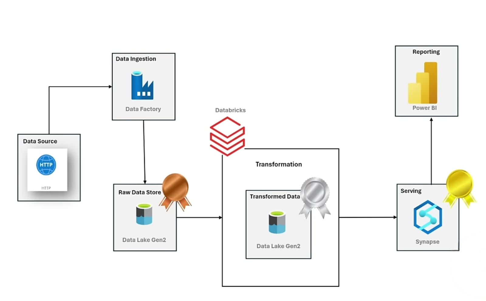

# AdventureWorks Data Engineering Project

## Introduction
This project demonstrates an end-to-end data engineering pipeline built on Microsoft Azure using the AdventureWorks dataset. It showcases how raw data is ingested from a public source, transformed using Databricks, and served through Synapse for reporting in Power BI.The pipeline is designed to enable efficient data transformation and access. It highlights real-world practices in building modern data workflows for analytics and reporting.

## Architecture Diagram

